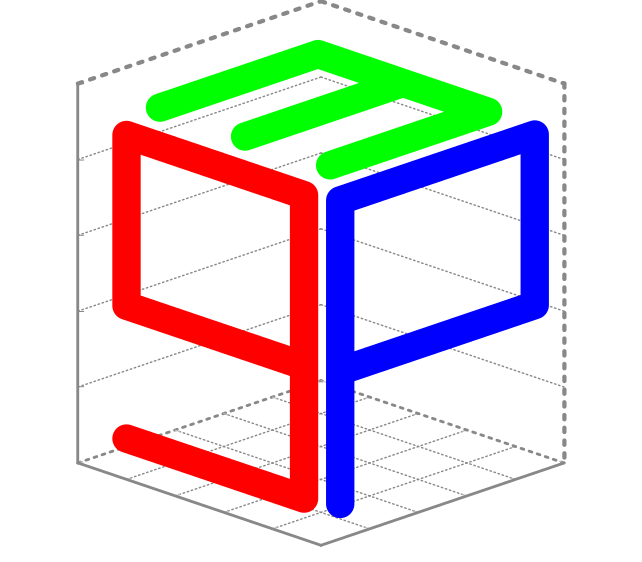
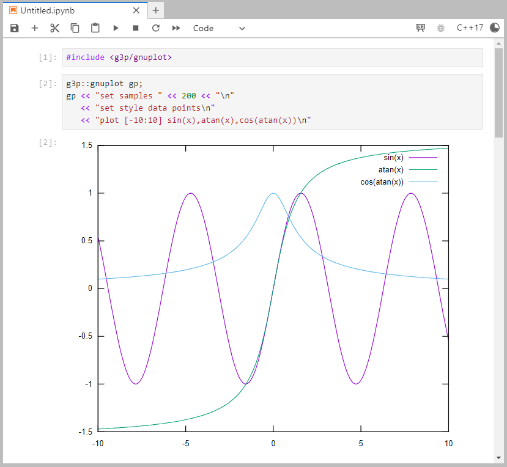

<div align="center">
  <a href="https://github.com/arminms/g3p">
    
  </a>
  <h1>G3P</h1>
</div>

[](https://github.com/arminms/g3p/releases)
[](https://github.com/arminms/g3p/blob/main/LICENSE)
[](https://github.com/arminms/g3p/actions/workflows/cmake-multi-platform.yml)
[](https://github.com/arminms/g3p/issues)
[](https://armin.sobhani.me/g3p/)
[](https://mybinder.org/v2/gh/arminms/g3p/HEAD?labpath=01_the_basics.ipynb)

`G3P` (`G`nu`P`lot `P`lus `P`lus) is a tiny but mighty header-only Modern C++ interface library for [gnuplot](http://www.gnuplot.info/). It is the most natural and intuitive way of adding `gnuplot` support into any C++ program.

A unique feature of `G3P` is the ability to embed plots/animations in *Jupyter C++ Notebooks* backed by [Xeus-Cling](https://github.com/jupyter-xeus/xeus-cling) kernel for rapid prototyping. If you have [Docker](https://docker.io), an easy way to learn about this feature is to run the prebuilt container:
```
docker run -p 8888:8888 -it --rm asobhani/g3p
```
Then click on the provided URL to connect to the Jupyter Server in the container and open `tutorial.ipynb` notebook.

If you don't have Docker, an easier but much slower way is to click on [](https://mybinder.org/v2/gh/arminms/g3p/HEAD?labpath=g3p_by_examples.ipynb) badge to launch it on [Binder](https://mybinder.org). 

**Key features include:**
- 🖥️ Multiplatform (Linux/macOS/Windows)
- 💥 No dependencies (except [gnuplot](http://www.gnuplot.info/))
- 🖇️ Header-only (only one header file)
- 🪶 Lightweight (~300 lines of code)
- ⚡ Fast (all i/o implemented with `C` API and `C++11` threading)
- 📊 Support embedding plots/animations in *Jupyter `C++` Notebooks* backed by [Xeus-Cling](https://github.com/jupyter-xeus/xeus-cling) kernel
- 🏫 Easy to learn. If you know [gnuplot](http://www.gnuplot.info/), you're already set.
- 📥 Easily integrates with existing libraries and code (via CMake configs)
- ➡️ Support [fluent interface](https://en.wikipedia.org/wiki/Fluent_interface)
- 🔀 Support both C (`%d`,`%f`, ...) and C++ (`<<`) conventions for passing arguments to [gnuplot](http://www.gnuplot.info/)
- 🧪 Include [Catch2](https://github.com/catchorg/Catch2) unit tests
- 📖 Well documented

## Quick example

```c++
#include <g3p/gnuplot>

g3p::gnuplot gp;
gp << "set samples" << 200 << "\n"
   << "set style data points\n"
   << "plot [-10:10] sin(x),atan(x),cos(atan(x))\n"
```
<p align="center"></p>

Please refer to the interactive documentation for more information: 👉 
[](https://armin.sobhani.me/g3p/) 👈
