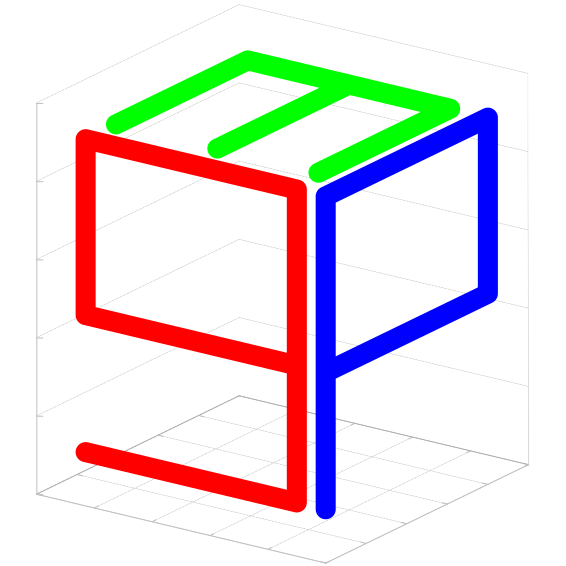
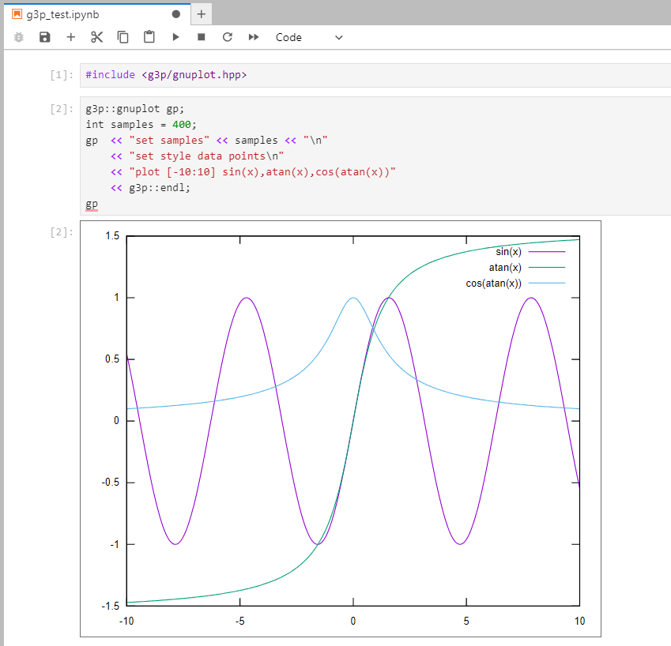
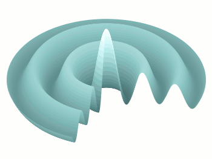

<div align="center">
  <a href="https://github.com/arminms/g3p">
    
  </a>
  <h1>g3p</h1>
</div>

[](https://github.com/arminms/g3p/releases)
[](https://github.com/arminms/g3p/blob/main/LICENSE)
[](https://github.com/arminms/g3p/actions/workflows/cmake-multi-platform.yml)
[](https://github.com/arminms/g3p/issues)
[](https://mybinder.org/v2/gh/arminms/g3p/HEAD?labpath=g3p_by_examples.ipynb)

`g3p` (`G`nu`P`lot `P`lus `P`lus) is a tiny but mighty header-only Modern C++ interface library for [gnuplot](http://www.gnuplot.info/). It is the most natural and intuitive way of adding `gnuplot` support into any C++ program.

A unique feature of `g3p` is the ability to display plots in *Jupyter C++ Notebooks* backed by [xeus-cling](https://github.com/jupyter-xeus/xeus-cling) for rapid prototyping. If you have [Docker](https://docker.io), an easy way to learn about this feature is to run the prebuilt container:
```
docker run -p 8888:8888 -t -i asobhani/g3p
```
Then click on the provided URL to connect to the Jupyter Server in the container and open `tutorial.ipynb` notebook.

If you don't have Docker, an easier but slower way is to click on [](https://mybinder.org/v2/gh/arminms/g3p/HEAD?labpath=g3p_by_examples.ipynb) badge to launch it on [Binder](https://mybinder.org). 

**Key features include:**
- 🖥️ Multiplatform (Linux/macOS/Windows)
- 💥 No dependencies (except [gnuplot](http://www.gnuplot.info/))
- 🖇️ Header-only (only one header file)
- 🪶 Lightweight (~300 lines of code)
- ⚡ Fast (all i/o implemented with C API and threaded)
- 📊 Support displaying plots in *Jupyter C++ Notebooks* via [xeus-cling](https://github.com/jupyter-xeus/xeus-cling)
- 🏫 Easy to learn. If you know [gnuplot](http://www.gnuplot.info/), you're already set.
- 📥 Easily integrates with existing libraries and code (via CMake configs)
- ➡️ Support [fluent interface](https://en.wikipedia.org/wiki/Fluent_interface)
- 🔀 Support both C (`%d`,`%f`, ...) and C++ (`<<`) conventions for passing arguments to [gnuplot](http://www.gnuplot.info/)
- 🧪 Include [Catch2](https://github.com/catchorg/Catch2) unit tests
<!-- - Well documented -->

## Table of contents
- [Requirements](#requirements)
- [Integration](#integration)
  - [CMake](#cmake)
    - [Embedded](#embedded)
- [Rapid prototyping with *Jupyter* using *xeus-cling*](#rapid-prototyping-with-jupyter-using-xeus-cling)
- [Example usage](#example-usage)
  - [C++ convention](#c-convention)
  - [C convention](#c-convention-1)
  - [Output](#output)

## Requirements
* [gnuplot](http://www.gnuplot.info/) (4 or higher) must be already installed and added to the `$PATH` environment variable
* C++ compiler supporting the `C++17` standard (e.g. *gcc* 9.3 or higher)

## Integration

[`gnuplot`](include/g3p/gnuplot) is the single required file in `include/g3p` or [released here](https://github.com/arminms/g3p/releases). You need to add:
```c++
#include <g3p/gnuplot>
```
At the begining of your code and set the necessary switches to enable `C++17` (e.g. `-std=c++17` for GCC and Clang).

Alternatively, you can build and install `g3p` using the following commands and then including `<g3p/gnuplot>`:
```bash
git clone https://github.com/arminms/g3p.git
cd g3p
cmake -S . -B build && cmake --build build
cmake --install build
```
*The last command on Linux/macOS must be preceded by `sudo`, and on Windows must be run as an administrator unless you add `--prefix` option at the end to change the default installation path to a none system folder (e.g. `cmake --install build --prefix ~/.local`).*

### CMake
`g3p` exports a (namespaced) CMake target (`g3p::g3p`) and also CMake config
scripts for downstream applications. This means that if `g3p` has been installed
on a system, it should be enough to do:
```cmake
find_package(g3p REQUIRED)
add_executable(test test.cpp)
target_link_libraries(test PRIVATE g3p::g3p)
```
#### Embedded
To embed the library directly into an existing CMake project, you can mix `find_package()` with [FetchContent](https://cmake.org/cmake/help/latest/module/FetchContent.html) available on CMake 3.14 and higher:
```cmake
include(FetchContent)
find_package(
  g3p CONFIG
  HINTS $ENV{HOME} $ENV{HOME}/.local /usr/local /usr
)
if(NOT g3p_FOUND)
    message(STATUS "Fetching g3p library...")
    include(FetchContent)
    FetchContent_Declare(
      g3p
      GIT_REPOSITORY https://github.com/arminms/g3p.git
      GIT_TAG main
    )
    FetchContent_MakeAvailable(g3p)
endif()
```
The above approach first tries to find an installed version of `g3p` and if not
then tries to fetch it from the repository. You can find a complete
example of the above approach in the [`example`](example/) folder.

## Rapid prototyping with *Jupyter* using *xeus-cling*
[xeus-cling](https://github.com/jupyter-xeus/xeus-cling) is a Jupyter kernel for C++ based on the C++ interpreter [cling](https://github.com/root-project/cling). The easiest way to install `xeus-cling` is to create an environment named `cling` using [mamba](https://mamba.readthedocs.io/en/latest/index.html):
```bash
mamba create -n cling
mamba activate cling
```
Then you can install `xeus-cling` in this environment and its dependencies:
```bash
mamba install xeus-cling -c conda-forge
```
Next, you can use `mamba env list` command to find where the `cling` environment is installed and use the following commands to install `g3p` in the `cling` environment:
```bash
git clone https://github.com/arminms/g3p.git
cd g3p
cmake -S . -B build && cmake --build build
cmake --install build --prefix PATH_TO_CLING_ENV
```
Now you can launch *Jupyter* with `jupyter lab` command and test your setup by opening [`doc/tutorial.ipynb`](doc/tutorial.ipynb) or typing the following demo plot in a `C++17` notebook and pressing <kbd>shift</kbd>+<kbd>enter</kbd> in the last cell:
```c++
#include <g3p/gnuplot>

g3p::gnuplot gp;
gp << "set samples" << 200 << "\n"
   << "set style data points\n"
   << "plot [-10:10] sin(x),atan(x),cos(atan(x))\n:
```
<p align="center"></p>

## Example usage
### C++ convention
```c++
#include <g3p/gnuplot>

int main(int argc, char* argv[])
{
    g3p::gnuplot gp;
    // based on https://gnuplotting.org/animation-gif/
    gp  << "set palette rgb 3,9,9\n"
        << "unset key; unset colorbox; unset border; unset tics\n"
        << "set lmargin at screen 0.03\n"
        << "set bmargin at screen 0\n"
        << "set rmargin at screen 0.97\n"
        << "set tmargin at screen 1\n"
        << "set parametric\n"
        << "bessel(x,t) = besj0(x) * cos(2*pi*t)\n"
        << "n = 6 # number of zeros\n"
        << "k = (n*pi-1.0/4*pi)\n"
        << "u_0 = k + 1/(8*k) - 31/(384*k)**3 + 3779/(15360*k)**5\n"
        << "set urange [0:u_0]\n"
        << "set vrange[0:1.5*pi]\n"
        << "set cbrange [-1:1]\n"
        << "set zrange[-1:1]\n"
        << "set isosamples 200,100\n"
        << "set pm3d depthorder\n"
        << "set view 40,200\n"
    ;
    for (float t = 0.0f; t < 2.0f; t += 0.02f)
        gp  << "splot u*sin(v),u*cos(v),bessel(u,"
            << t
            << ") w pm3d ls 1\n"
        ;
}
```
### C convention
```c++
#include <g3p/gnuplot>

int main(int argc, char* argv[])
{
    g3p::gnuplot gp;
    // based on http://gnuplotting.org/animation-gif
    gp( "set palette rgb 3,9,9" )
      ( "unset key; unset colorbox; unset border; unset tics" )
      ( "set lmargin at screen 0.03" )
      ( "set bmargin at screen 0" )
      ( "set rmargin at screen 0.97" )
      ( "set tmargin at screen 1" )
      ( "set parametric" )
      ( "bessel(x,t) = besj0(x) * cos(2*pi*t)" )
      ( "n = 6 # number of zeros" )
      ( "k = (n*pi-1.0/4*pi)" )
      ( "u_0 = k + 1/(8*k) - 31/(384*k)**3 + 3779/(15360*k)**5" )
      ( "set urange [0:u_0]" )
      ( "set vrange[0:1.5*pi]" )
      ( "set cbrange [-1:1]" )
      ( "set zrange[-1:1]" )
      ( "set isosamples 200,100" )
      ( "set pm3d depthorder" )
      ( "set view 40,200" )
    ;
    for (float t = 0.0f; t < 2.0f; t += 0.02f)
        gp("splot u*sin(v),u*cos(v),bessel(u,%f) w pm3d ls 1", t);
}
```
### Output
Here's the output of the above programs:


